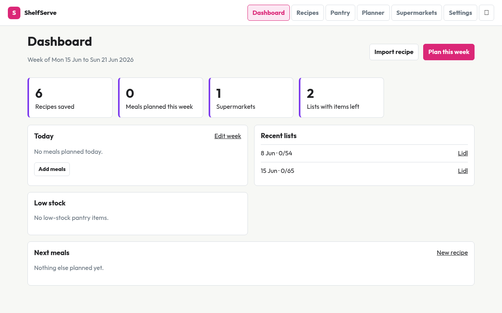
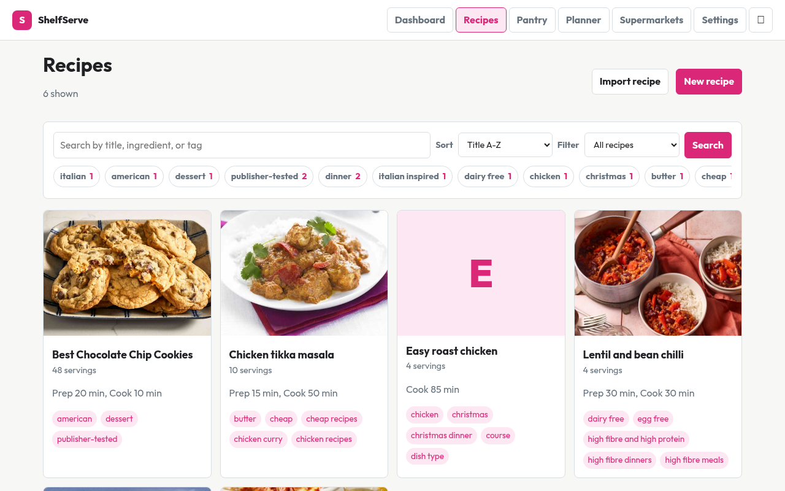
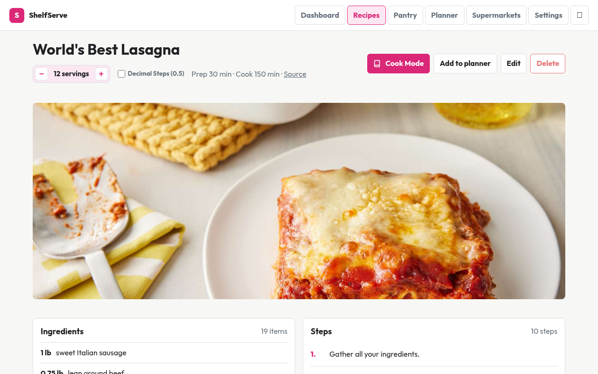
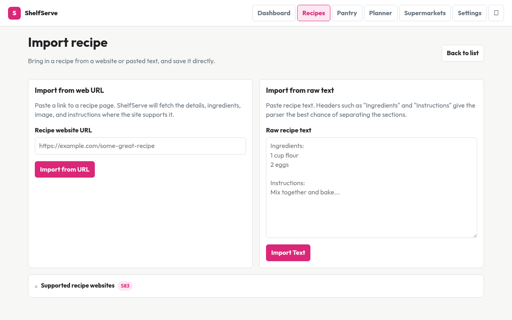
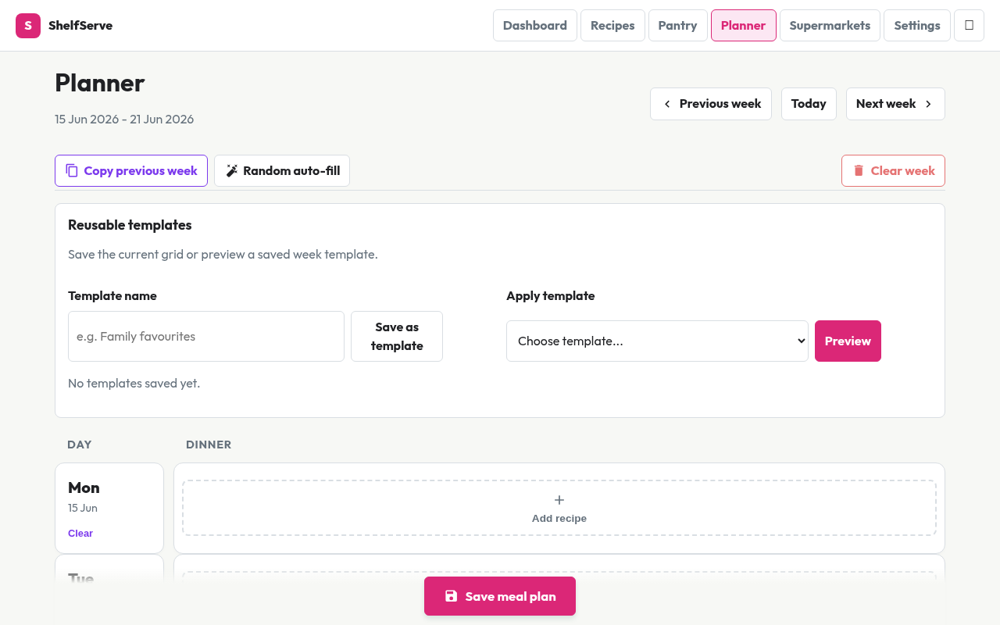

# ShelfServe

ShelfServe is a [Home Assistant](https://www.home-assistant.io/) OS add-on for storing recipes, planning meals, and generating supermarket-sorted shopping lists. The add-on runs a Django app through Home Assistant ingress, opening from the sidebar without exposing a separate public web service.



## Features

- **Import recipes from the web** -- paste a URL from 580+ supported recipe sites (BBC Good Food, AllRecipes, Jamie Oliver, NYT Cooking, Simply Recipes, and many more). Ingredients, steps, servings, cook times, images, and tags are extracted automatically.
- **Recipe library** -- browse, search, sort, filter by tag or category, and mark favorites.
- **Meal planner** -- plan breakfast, lunch, and dinner by week. Apply reusable weekly templates.
- **Shopping lists** -- generate a shopping list from the meal plan, grouped by supermarket aisle. Check items off while shopping, restock pantry from checked items.
- **Pantry tracking** -- track stock levels with low-stock alerts. Pantry is deducted automatically when meals are marked as cooked.
- **Supermarket configuration** -- define stores, configure aisle order, and see shopping items sorted by aisle.
- **Cook mode** -- full-screen step-by-step cooking view with built-in timers, serving scaler, and ingredient scaling.

## Screenshots

| Recipe library | Recipe detail |
|:---:|:---:|
|  |  |

| Recipe import | Meal planner |
|:---:|:---:|
|  |  |

## Example Recipes (imported from the web)

These recipes were imported from the internet by pasting their URLs into the ShelfServe import form. The app's parser extracts title, ingredients, steps, cook times, images, and tags from the source page automatically.

| Recipe | Source | Imported From |
|--------|--------|---------------|
| World's Best Lasagna | AllRecipes | `https://www.allrecipes.com/recipe/23600/worlds-best-lasagna/` |
| Chicken Tikka Masala | BBC Good Food | `https://www.bbcgoodfood.com/recipes/chicken-tikka-masala` |
| Mushroom Risotto | BBC Good Food | `https://www.bbcgoodfood.com/recipes/mushroom-risotto` |
| Easy Roast Chicken | Jamie Oliver | `https://www.jamieoliver.com/recipes/chicken-recipes/perfect-roast-chicken/` |
| Best Chocolate Chip Cookies | AllRecipes | `https://www.allrecipes.com/recipe/10813/best-chocolate-chip-cookies/` |
| Lentil and Bean Chilli | BBC Food | `https://www.bbc.co.uk/food/recipes/lentil_and_bean_chilli_23` |

## Importing Recipes from the Web

1. Go to **Recipes > Import** in the app.
2. Paste a recipe URL from a supported site.
3. Click **Import** -- the app fetches the page, parses the structured data, and saves the recipe with all ingredients, steps, and an image (if available).
4. The recipe appears in your library, ready to be added to the meal planner.

The import feature uses the [recipe-scrapers](https://github.com/hhursev/recipe-scrapers) library, supporting over 580 recipe websites. It also accepts raw pasted recipe text for sites that aren't supported.

## Repository Layout

```text
.
|-- repository.yaml              # Home Assistant add-on repository metadata
`-- recipe_planner/
    |-- config.yaml              # ShelfServe add-on metadata & version
    |-- Dockerfile               # Add-on image build
    |-- run.sh                   # Container startup script
    |-- icon.png                 # Add-on icon
    |-- logo.png                 # Add-on logo
    `-- app/
        |-- manage.py
        |-- requirements.txt
        |-- shelfserve/          # Django project settings
        `-- recipes/             # Main Django app
```

## Install in Home Assistant

1. Open Home Assistant.
2. Go to **Settings > Add-ons > Add-on Store**.
3. Open the three-dot menu and choose **Repositories**.
4. Add this repository URL:

   ```text
   https://github.com/bslater509/shelfserve
   ```

5. Install **ShelfServe** from the add-on store.
6. Start the add-on.
7. Open **ShelfServe** from the Home Assistant sidebar or the add-on Web UI button.

## Local Development

### Docker Compose (recommended)

Build and start the container from `recipe_planner/`:

```bash
docker compose -f recipe_planner/docker-compose.yml up --build -d
```

The app is then available at `http://127.0.0.1:8099/`.

To stop:

```bash
docker compose -f recipe_planner/docker-compose.yml down
```

### Manual Docker

```bash
docker build \
  --build-arg BUILD_VERSION=dev \
  --build-arg BUILD_ARCH=amd64 \
  -t shelfserve:dev \
  recipe_planner

docker run --rm \
  --name shelfserve-dev \
  -d \
  -p 8099:8099 \
  -e SHELFSERVE_SECRET_KEY=development-only-change-me \
  -e SHELFSERVE_DEBUG=1 \
  -e SHELFSERVE_LOG_LEVEL=debug \
  -v shelfserve-dev-data:/data \
  shelfserve:dev
```

### Python (no Docker)

Create a virtual environment and install dependencies from `recipe_planner/app/`:

```bash
python -m venv .venv
source .venv/bin/activate
pip install -r requirements.txt
```

Run checks, tests, and migrations:

```bash
python manage.py check
python manage.py test
python manage.py migrate
python manage.py runserver
```

The dev server is at `http://127.0.0.1:8000/`.

## Container Startup

The add-on starts with `recipe_planner/run.sh`, which:

- Uses `/data` for persistent add-on data by default.
- Creates `/data/media` and `/data/static`.
- Runs database migrations.
- Collects static files.
- Starts Gunicorn on port `8099`.

## Home Assistant Ingress

ShelfServe is served under a generated Home Assistant ingress path such as `/3975db7c_shelfserve/`. Templates use Django URL and static helpers (``, ``) so navigation, assets, forms, and CSRF checks work through the ingress path without hard-coded root-relative links.

## Updating the Add-On

1. Bump `recipe_planner/config.yaml` `version` and add an entry to `recipe_planner/CHANGELOG.md`.
2. Commit and push.
3. In Home Assistant, go to **Settings > Add-ons > Add-on Store**, three-dot menu **Check for updates**.
4. Update ShelfServe and restart.
